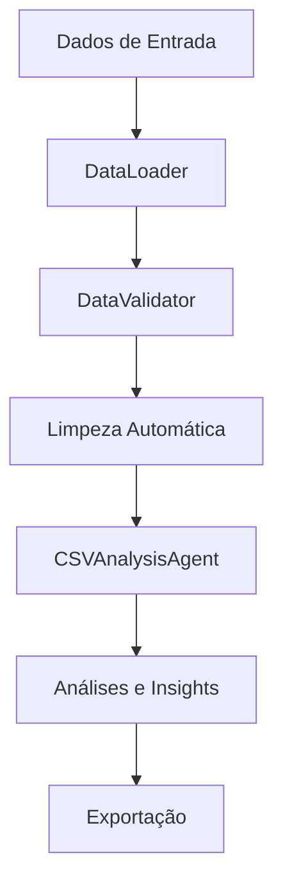

# Sistema de Carregamento de Dados - EDA AI Minds

## Visão Geral

O Sistema de Carregamento de Dados é uma solução completa e inteligente para processar dados CSV de múltiplas fontes, com validação automática, limpeza de dados e análise integrada. Foi desenvolvido para ser a porta de entrada principal do sistema EDA AI Minds.

## Componentes Principais

### 1. DataLoader (`src/data/data_loader.py`)
**Responsabilidade:** Carregamento de dados de múltiplas fontes

**Funcionalidades:**
- ✅ Carregamento de arquivos locais com detecção automática de encoding
- ✅ Download de arquivos CSV via HTTP/HTTPS
- ✅ Processamento de uploads base64
- ✅ Integração com DataFrames pandas existentes
- ✅ Geração de dados sintéticos para testes e demonstrações
- ✅ Validação de tamanho de arquivos e timeouts configuráveis

**Formatos Suportados:**
- Arquivos CSV locais
- URLs remotas (HTTP/HTTPS)
- Dados base64 (uploads web)
- DataFrames pandas
- Dados sintéticos (fraude, vendas, clientes, genéricos)

### 2. DataValidator (`src/data/data_validator.py`)
**Responsabilidade:** Validação e limpeza automática de dados

**Funcionalidades:**
- ✅ Análise completa da qualidade dos dados
- ✅ Detecção de problemas estruturais e de conteúdo
- ✅ Limpeza automática de dados problemáticos
- ✅ Relatórios detalhados de qualidade com scoring
- ✅ Sugestões inteligentes de melhorias
- ✅ Normalização de tipos de dados

**Validações Realizadas:**
- Estrutura do DataFrame (nomes de colunas, duplicatas)
- Qualidade do conteúdo (valores faltantes, suspeitos)
- Análise de distribuições e correlações
- Detecção de outliers
- Verificação de unicidade e completude

### 3. DataProcessor (`src/data/data_processor.py`)
**Responsabilidade:** Interface unificada que integra todos os componentes

**Funcionalidades:**
- ✅ Interface única para todas as operações de dados
- ✅ Processamento automático (carregamento + validação + limpeza)
- ✅ Integração direta com CSVAnalysisAgent
- ✅ Análises rápidas automáticas
- ✅ Exportação de resultados processados
- ✅ Relatórios consolidados

## Fluxo de Processamento



1. **Carregamento:** DataLoader processa a fonte dos dados
2. **Validação:** DataValidator analisa qualidade e detecta problemas
3. **Limpeza:** Correção automática de problemas detectados
4. **Análise:** Integração com CSVAnalysisAgent para análises inteligentes
5. **Insights:** Geração de relatórios e visualizações
6. **Exportação:** Salvamento dos dados processados

## Uso Prático

### Carregamento Simples
```python
from src.data.data_processor import create_demo_data, load_csv_file

# Dados sintéticos para teste
processor = create_demo_data("fraud_detection", num_rows=1000)

# Arquivo local
processor = load_csv_file("meus_dados.csv")

# Análise rápida
resultados = processor.quick_analysis()
```

### Uso Avançado
```python
from src.data.data_processor import DataProcessor

# Configuração personalizada
processor = DataProcessor(auto_validate=True, auto_clean=True)

# Carregar de URL
result = processor.load_from_url("https://exemplo.com/dados.csv")

# Relatório de qualidade
quality = processor.get_data_quality_report()
print(f"Score de qualidade: {quality['overall_score']:.1f}/100")

# Sugestões de melhoria
suggestions = processor.suggest_improvements()
for suggestion in suggestions:
    print(f"[{suggestion['priority']}] {suggestion['description']}")

# Análises interativas
result = processor.analyze("Qual a correlação entre as variáveis?")
print(result['content'])

# Exportar resultados
processor.export_to_csv("dados_processados.csv")
```

### Carregamento de Upload Web
```python
# Para integração com APIs web
def process_csv_upload(base64_content, filename):
    processor = DataProcessor()
    result = processor.load_from_upload(base64_content, filename)
    
    if result['success']:
        return {
            'message': result['message'],
            'quality_score': result.get('validation', {}).get('score', 0),
            'data_summary': processor.get_dataset_summary()
        }
    else:
        return {'error': result['error']}
```

## Tipos de Dados Sintéticos

### 1. Fraud Detection (`fraud_detection`)
**Uso:** `create_demo_data("fraud_detection", num_rows=2000, fraud_rate=0.05)`

**Colunas geradas:**
- `transaction_id`: ID único da transação
- `amount`: Valor da transação (log-normal)
- `merchant_category`: Categoria do estabelecimento
- `hour`: Hora do dia (0-23)
- `day_of_week`: Dia da semana (1-7)
- `customer_age`: Idade do cliente
- `account_balance`: Saldo da conta
- `transactions_today`: Número de transações no dia
- `is_weekend`: Indicador de fim de semana
- `distance_from_home`: Distância de casa (km)
- `is_fraud`: Indicador de fraude (target)

### 2. Sales (`sales`)
**Uso:** `create_demo_data("sales", num_rows=1000, start_date="2024-01-01")`

**Colunas geradas:**
- `date`: Data da venda
- `product_id`: ID do produto
- `category`: Categoria do produto
- `price`: Preço unitário
- `quantity`: Quantidade vendida
- `sales_rep`: Representante de vendas
- `region`: Região de venda
- `customer_type`: Tipo de cliente (novo/retornante/vip)
- `total_amount`: Valor total (price × quantity)

### 3. Customer (`customer`)
**Uso:** `create_demo_data("customer", num_rows=500)`

**Colunas geradas:**
- `customer_id`: ID único do cliente
- `age`: Idade
- `income`: Renda anual
- `education`: Nível educacional
- `city_tier`: Classificação da cidade (1-3)
- `years_experience`: Anos de experiência profissional
- `credit_score`: Score de crédito
- `owns_home`: Proprietário de imóvel
- `married`: Estado civil

### 4. Generic (`generic`)
**Uso:** `create_demo_data("generic", num_rows=300, num_numeric=5, num_categorical=3)`

**Colunas geradas:**
- `numeric_1`, `numeric_2`, ...: Colunas numéricas
- `category_1`, `category_2`, ...: Colunas categóricas
- `id`: Identificador único

## Configurações e Limites

### DataLoader
```python
# Configurações padrão (podem ser alteradas)
max_file_size_mb = 500          # Tamanho máximo de arquivo
timeout_seconds = 30            # Timeout para downloads
default_encoding = 'utf-8'      # Encoding padrão
supported_encodings = [         # Encodings suportados para detecção
    'utf-8', 'latin-1', 'iso-8859-1', 'cp1252', 'utf-16'
]
```

### DataValidator
```python
# Configurações de validação
max_missing_percentage = 90     # % máximo de valores faltantes por coluna
min_unique_values = 2          # Mínimo de valores únicos por coluna
```

## Scores de Qualidade

O sistema atribui scores de 0-100 para a qualidade dos dados baseado em:

- **Estrutura (25%):** Nomes de colunas válidos, ausência de duplicatas
- **Conteúdo (25%):** Baixa porcentagem de valores faltantes e suspeitos
- **Completude (25%):** Porcentagem de valores não-nulos
- **Unicidade (25%):** Ausência de registros duplicados

### Interpretação dos Scores
- **90-100:** Excelente qualidade, dados prontos para análise
- **80-89:** Boa qualidade, pequenos ajustes podem ser necessários
- **70-79:** Qualidade moderada, limpeza recomendada
- **60-69:** Qualidade baixa, limpeza necessária
- **<60:** Qualidade muito baixa, revisão manual recomendada

## Logs e Monitoramento

O sistema gera logs estruturados para todas as operações:

```python
# Exemplos de logs gerados
2025-09-28 06:22:22 | INFO | DataLoader inicializado
2025-09-28 06:22:22 | INFO | Carregando arquivo: dados.csv (2.3MB)
2025-09-28 06:22:22 | INFO | Encoding detectado: utf-8 (confiança: 0.95)
2025-09-28 06:22:22 | INFO | ✅ Arquivo carregado: 5000 linhas, 15 colunas
2025-09-28 06:22:22 | INFO | Validação concluída. Score: 87.3/100
2025-09-28 06:22:22 | INFO | Limpeza automática: 3 ações realizadas
```

## Tratamento de Erros

### Erros Comuns e Soluções

1. **Arquivo não encontrado**
   - Erro: `DataLoaderError: Arquivo não encontrado: caminho.csv`
   - Solução: Verificar se o caminho está correto

2. **Arquivo muito grande**
   - Erro: `DataLoaderError: Arquivo muito grande: 600MB (máximo: 500MB)`
   - Solução: Dividir arquivo ou aumentar limite

3. **Encoding não detectado**
   - Aviso: `Baixa confiança na detecção de encoding (0.45)`
   - Solução: Especificar encoding manualmente

4. **URL inacessível**
   - Erro: `DataLoaderError: Erro ao carregar URL: Connection timeout`
   - Solução: Verificar conectividade e aumentar timeout

5. **DataFrame vazio**
   - Erro: `DataValidationError: DataFrame está vazio`
   - Solução: Verificar se os dados foram carregados corretamente

## Performance e Otimizações

### Recomendações de Performance
- Arquivos até 100MB: Processamento instantâneo
- Arquivos 100-500MB: Processamento em segundos
- Para arquivos maiores: Considere chunking ou processamento por partes

### Otimizações Implementadas
- Detecção inteligente de encoding (evita tentativa e erro)
- Limpeza seletiva (apenas quando necessário)
- Cache de resultados de validação
- Processamento incremental para grandes datasets

## Integração com CSVAnalysisAgent

O DataProcessor integra automaticamente com o CSVAnalysisAgent, permitindo:

```python
processor = load_csv_file("dados.csv")

# Análises diretas
result = processor.analyze("Faça um resumo dos dados")
result = processor.analyze("Analise correlações entre variáveis")
result = processor.analyze("Detecte padrões de fraude")

# Análises automáticas
quick_results = processor.quick_analysis()
# Inclui: resumo básico, correlações, detecção de fraude (se aplicável)
```

## Próximos Desenvolvimentos

- ✅ Suporte a múltiplos formatos de arquivo (CSV, Excel, JSON)
- ⏳ Processamento de dados em streaming
- ⏳ Integração com bancos de dados
- ⏳ API REST para carregamento remoto
- ⏳ Interface web para upload e processamento
- ⏳ Suporte a dados não estruturados

## Exemplos de Uso Real

### Análise de Fraude em Cartão de Crédito
```python
# Carregar dados de fraude do Kaggle
processor = load_csv_file("creditcard_fraud.csv")

# Análise automática
results = processor.quick_analysis()
print(f"Taxa de fraude detectada: {results['fraud_analysis']['metadata']['fraud_rate']:.2f}%")

# Análises específicas
processor.analyze("Quais são os principais indicadores de fraude?")
processor.analyze("Crie um gráfico da distribuição de fraudes por hora")
```

### Análise de Vendas
```python
# Gerar dados de vendas sintéticos
processor = create_demo_data("sales", num_rows=10000, start_date="2023-01-01")

# Análises de performance
processor.analyze("Qual produto teve maior faturamento?")
processor.analyze("Analise a sazonalidade das vendas")
processor.analyze("Compare performance por região")
```

---

**Documentação atualizada em:** 28 de setembro de 2025  
**Versão do sistema:** 1.0.0  
**Status:** ✅ Funcionando completamente