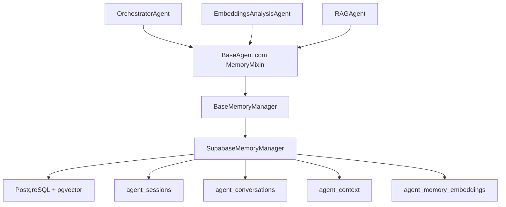
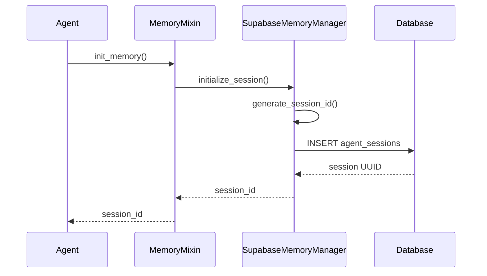
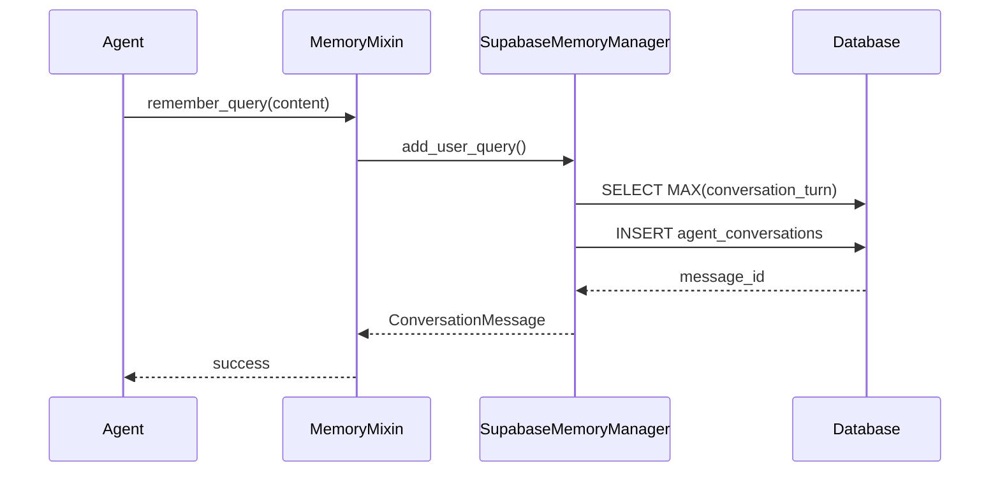
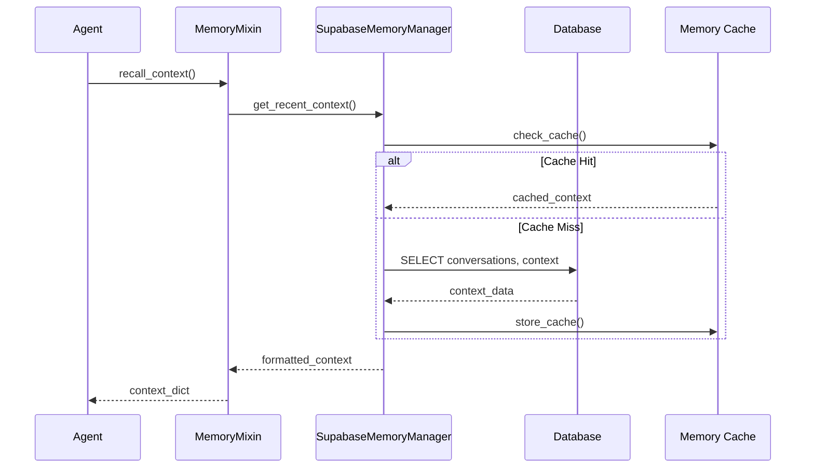

# Arquitetura do Sistema de Memória Persistente

## 🧠 Visão Geral

O sistema de memória persistente foi projetado para permitir que os agentes multiagente mantenham estado e contexto entre sessões, proporcionando experiências mais inteligentes e personalizadas aos usuários.

## 📐 Arquitetura Técnica

### Componentes Principais



### Camadas da Arquitetura

#### 1. **Camada de Interface** (`MemoryMixin`)
- Fornece métodos padronizados para todos os agentes
- Abstrai complexidade do gerenciamento de memória
- Permite integração transparente com agentes existentes

#### 2. **Camada de Abstração** (`BaseMemoryManager`)
- Define interface comum para diferentes backends de memória
- Permite troca de implementações sem alterar agentes
- Suporte a múltiplos tipos de armazenamento

#### 3. **Camada de Implementação** (`SupabaseMemoryManager`)
- Implementação concreta usando Supabase/PostgreSQL
- Otimizações específicas para banco relacional
- Integração com pgvector para busca semântica

#### 4. **Camada de Persistência** (Banco de Dados)
- Tabelas especializadas para diferentes tipos de memória
- Índices otimizados para consultas frequentes
- Funcionalidades de limpeza automática

## 🗄️ Schema de Banco de Dados

### Tabela: `agent_sessions`
Armazena informações de sessões de agentes.

```sql
CREATE TABLE agent_sessions (
    id UUID PRIMARY KEY DEFAULT gen_random_uuid(),
    session_id VARCHAR(255) UNIQUE NOT NULL,
    user_id VARCHAR(255),
    agent_name VARCHAR(100) NOT NULL,
    session_type VARCHAR(50) DEFAULT 'interactive',
    status VARCHAR(20) DEFAULT 'active',
    created_at TIMESTAMP WITH TIME ZONE DEFAULT NOW(),
    updated_at TIMESTAMP WITH TIME ZONE DEFAULT NOW(),
    expires_at TIMESTAMP WITH TIME ZONE DEFAULT (NOW() + INTERVAL '24 hours'),
    metadata JSONB DEFAULT '{}'
);
```

**Índices:**
- `idx_agent_sessions_session_id` (único)
- `idx_agent_sessions_user_agent` (user_id, agent_name)
- `idx_agent_sessions_status` (status)
- `idx_agent_sessions_expires` (expires_at)

### Tabela: `agent_conversations`
Armazena o histórico de conversações entre usuários e agentes.

```sql
CREATE TABLE agent_conversations (
    id UUID PRIMARY KEY DEFAULT gen_random_uuid(),
    session_id UUID NOT NULL REFERENCES agent_sessions(id) ON DELETE CASCADE,
    agent_name VARCHAR(100) NOT NULL,
    conversation_turn INTEGER NOT NULL,
    message_type VARCHAR(20) NOT NULL,
    content TEXT NOT NULL,
    content_format VARCHAR(20) DEFAULT 'text',
    processing_time_ms INTEGER,
    confidence_score DECIMAL(3,2),
    metadata JSONB DEFAULT '{}',
    timestamp TIMESTAMP WITH TIME ZONE DEFAULT NOW()
);
```

**Índices:**
- `idx_agent_conversations_session` (session_id)
- `idx_agent_conversations_turn` (session_id, conversation_turn)
- `idx_agent_conversations_type` (message_type)
- `idx_agent_conversations_timestamp` (timestamp)

### Tabela: `agent_context`
Armazena contexto e estado dos agentes.

```sql
CREATE TABLE agent_context (
    id UUID PRIMARY KEY DEFAULT gen_random_uuid(),
    session_id UUID NOT NULL REFERENCES agent_sessions(id) ON DELETE CASCADE,
    agent_name VARCHAR(100) NOT NULL,
    context_type VARCHAR(50) NOT NULL,
    context_key VARCHAR(255) NOT NULL,
    context_data JSONB NOT NULL,
    data_size_bytes INTEGER,
    access_count INTEGER DEFAULT 0,
    priority INTEGER DEFAULT 5,
    created_at TIMESTAMP WITH TIME ZONE DEFAULT NOW(),
    updated_at TIMESTAMP WITH TIME ZONE DEFAULT NOW(),
    last_accessed_at TIMESTAMP WITH TIME ZONE,
    expires_at TIMESTAMP WITH TIME ZONE,
    metadata JSONB DEFAULT '{}'
);
```

**Índices:**
- `idx_agent_context_session` (session_id)
- `idx_agent_context_key` (session_id, context_key)
- `idx_agent_context_type` (context_type)
- `idx_agent_context_access` (access_count DESC)

### Tabela: `agent_memory_embeddings`
Armazena embeddings para busca semântica.

```sql
CREATE TABLE agent_memory_embeddings (
    id UUID PRIMARY KEY DEFAULT gen_random_uuid(),
    session_id UUID NOT NULL REFERENCES agent_sessions(id) ON DELETE CASCADE,
    agent_name VARCHAR(100) NOT NULL,
    embedding_type VARCHAR(50) NOT NULL,
    source_text TEXT NOT NULL,
    source_hash VARCHAR(64),
    embedding vector(1536) NOT NULL,
    similarity_threshold DECIMAL(4,3) DEFAULT 0.800,
    created_at TIMESTAMP WITH TIME ZONE DEFAULT NOW(),
    metadata JSONB DEFAULT '{}'
);
```

**Índices:**
- `idx_agent_embeddings_session` (session_id)
- `idx_agent_embeddings_type` (embedding_type)
- `idx_agent_embeddings_hash` (source_hash)
- `idx_agent_embeddings_vector` USING hnsw (embedding vector_cosine_ops)

## 🔧 Tipos de Dados e Estruturas

### Enums e Constantes

```python
class SessionType(str, Enum):
    INTERACTIVE = "interactive"
    BATCH = "batch"
    BACKGROUND = "background"

class SessionStatus(str, Enum):
    ACTIVE = "active"
    COMPLETED = "completed"
    EXPIRED = "expired"
    TERMINATED = "terminated"

class MessageType(str, Enum):
    QUERY = "query"
    RESPONSE = "response"
    SYSTEM = "system"
    ERROR = "error"

class ContextType(str, Enum):
    DATA = "data"
    USER_PREFERENCE = "user_preference"
    ANALYSIS_CACHE = "analysis_cache"
    SEARCH_CACHE = "search_cache"
    LEARNING_PATTERN = "learning_pattern"

class EmbeddingType(str, Enum):
    QUERY = "query"
    RESPONSE = "response"
    CONTEXT = "context"
    DOCUMENT = "document"
```

### Dataclasses Principais

#### SessionInfo
```python
@dataclass
class SessionInfo:
    session_id: str
    user_id: Optional[str] = None
    agent_name: Optional[str] = None
    session_type: SessionType = SessionType.INTERACTIVE
    status: SessionStatus = SessionStatus.ACTIVE
    created_at: Optional[datetime] = None
    updated_at: Optional[datetime] = None
    expires_at: Optional[datetime] = None
    metadata: Dict[str, Any] = field(default_factory=dict)
```

#### ConversationMessage
```python
@dataclass
class ConversationMessage:
    session_id: UUID
    agent_name: str
    conversation_turn: int
    message_type: MessageType
    content: str
    content_format: str = "text"
    processing_time_ms: Optional[int] = None
    confidence_score: Optional[float] = None
    metadata: Dict[str, Any] = field(default_factory=dict)
    timestamp: Optional[datetime] = None
```

#### AgentContext
```python
@dataclass
class AgentContext:
    session_id: UUID
    agent_name: str
    context_type: ContextType
    context_key: str
    context_data: Dict[str, Any]
    data_size_bytes: Optional[int] = None
    access_count: int = 0
    priority: int = 5
    created_at: Optional[datetime] = None
    updated_at: Optional[datetime] = None
    last_accessed_at: Optional[datetime] = None
    expires_at: Optional[datetime] = None
    metadata: Dict[str, Any] = field(default_factory=dict)
```

## 🚀 Fluxos de Operação

### 1. Inicialização de Sessão



### 2. Salvamento de Conversação



### 3. Recuperação de Contexto



## 🎯 Integrações com Agentes

### OrchestratorAgent
- **Sessão Persistente**: Mantém estado da coordenação multiagente
- **Contexto de Conversa**: Histórico completo das interações
- **Cache de Decisões**: Otimiza roteamento baseado em padrões aprendidos

```python
# Exemplo de uso
orchestrator = OrchestratorAgent("main_orchestrator")
session_id = await orchestrator.init_memory()

# Processar com memória persistente
result = await orchestrator.process_with_persistent_memory(
    "Analise o dataset de fraudes e gere um relatório"
)
```

### EmbeddingsAnalysisAgent
- **Cache de Análises**: Evita reprocessamento de dados similares
- **Padrões de Query**: Aprende preferências analíticas do usuário
- **Otimização de Performance**: Reduz tempo de resposta em análises repetitivas

```python
# Exemplo de uso
csv_agent = EmbeddingsAnalysisAgent("csv_analyzer")
await csv_agent.init_memory()

# Análise com cache inteligente
result = await csv_agent.process_with_memory(
    "Detecte padrões de fraude neste dataset",
    dataframe=df
)
```

### RAGAgent
- **Cache de Buscas**: Armazena resultados de buscas vetoriais
- **Aprendizado de Relevância**: Adapta threshold baseado em feedback
- **Threshold Adaptativo**: Melhora precisão ao longo do tempo

```python
# Exemplo de uso
rag_agent = RAGAgent("rag_searcher")
await rag_agent.init_memory()

# Busca com aprendizado contínuo
results = await rag_agent.search_with_memory(
    "Como detectar anomalias em transações?",
    use_adaptive_threshold=True
)
```

## ⚡ Otimizações e Performance

### Cache em Memória
- **LRU Cache**: Para contextos frequentemente acessados
- **TTL (Time To Live)**: Expiração automática de cache
- **Compressão**: Para dados grandes e pouco acessados

### Índices de Banco
- **HNSW**: Para busca vetorial eficiente
- **Compostos**: Para consultas multi-coluna
- **Parciais**: Para dados filtrados por status

### Limpeza Automática
- **Sessões Expiradas**: Remoção automática após TTL
- **Conversações Antigas**: Compressão em sumários
- **Embeddings Órfãos**: Limpeza de referências quebradas

### Monitoramento
- **Métricas de Performance**: Tempo de resposta, cache hit rate
- **Alertas**: Para sessões com muitos dados ou problemas
- **Logs Estruturados**: Para debugging e análise

## 🔒 Segurança e Privacidade

### Isolamento de Dados
- **Sessões por Usuário**: Dados completamente isolados
- **Agentes Específicos**: Contexto segregado por agente
- **TTL Configurável**: Controle de retenção de dados

### Validação
- **Sanitização**: Limpeza de dados de entrada
- **Validação de Tamanho**: Limites para prevenir DoS
- **Encoding Seguro**: UTF-8 com escape de caracteres especiais

### Compliance
- **LGPD/GDPR**: Suporte a direito ao esquecimento
- **Auditoria**: Logs de acesso e modificação
- **Criptografia**: Dados sensíveis em repouso

## 📈 Métricas e Monitoramento

### KPIs Principais
- **Cache Hit Rate**: % de consultas atendidas pelo cache
- **Tempo de Resposta**: Latência média de operações
- **Uso de Memória**: Consumo de recursos por sessão
- **Taxa de Expiração**: % de sessões que expiram vs completam

### Alertas Configurados
- Sessões com > 100MB de contexto
- Cache hit rate < 70%
- Tempo de resposta > 500ms
- Mais de 1000 conversações por sessão

### Dashboards
- Performance em tempo real
- Uso por agente e usuário
- Tendências de crescimento de dados
- Eficiência de limpeza automática

---

Esta arquitetura foi projetada para escalar horizontalmente e suportar milhares de sessões simultâneas, mantendo performance e confiabilidade.

## 📚 Próximos Passos

1. **Implementação de Clustering**: Para distribuição de carga
2. **Cache Distribuído**: Redis para múltiplas instâncias
3. **Análise Preditiva**: ML para otimização automática
4. **API GraphQL**: Para consultas flexíveis
5. **Streaming**: Para conversações em tempo real